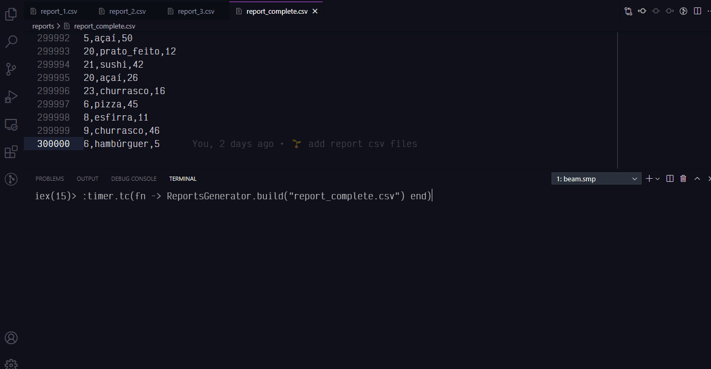

# ReportsGenerator

O que é mais rápido?
* Ler um arquivo de 300 mil linhas
* ou 3 arquivos de 100 mil linhas cada??

Pra finalizar o primeiro módulo do bootcamp Ignite Elixir da Rocketseat, o mestre Rafael Camarda nos ensinou como podemos ler 3 arquivos em paralelo no #Elixir, ao invés de um arquivo só, e obter uma melhor performance, usando toda a capacidade de processamento da nossa máquina :)

## Final Result



- lendo só um arquivo de 300 mil linhas, o tempo em microsegundos foi de 1367922
```bash
iex> :timer.tc(fn -> ReportsGenerator.build("report_complete.csv") end)
{1367922,
 %{
   "foods" => %{
     "açaí" => 37742,
     "churrasco" => 37650,
     "esfirra" => 37462,
     "hambúrguer" => 37577,
     "pastel" => 37392,
     "pizza" => 37365,
     "prato_feito" => 37519,
     "sushi" => 37293
   },
   "users" => %{
     "1" => 278849,
     "10" => 268317,
     "11" => 268877,
     "12" => 276306,
     "13" => 282953,
     "14" => 277084,
     "15" => 280105,
     "16" => 271831,
     "17" => 272883,
     "18" => 271421,
     "19" => 277720,
     "2" => 271031,
     "20" => 273446,
     "21" => 275026,
     "22" => 278025,
     "23" => 276523,
     "24" => 274481,
     "25" => 274512,
     "26" => 274199,
     ...
```
- lendo 3 arquivos de 100 mil linhas cada, o tempo em microsegundos foi de 434912
```bash
iex> :timer.tc(fn -> ReportsGenerator.build_from_many(["report_1.csv", "report_2.csv", "report_3.csv"]) end)
{434912,
 {:ok,
  %{
    "foods" => %{
      "açaí" => 37742,
      "churrasco" => 37650,
      "esfirra" => 37462,
      "hambúrguer" => 37577,
      "pastel" => 37392,
      "pizza" => 37365,
      "prato_feito" => 37519,
      "sushi" => 37293
    },
    "users" => %{
      "1" => 278849,
      "10" => 268317,
      "11" => 268877,
      "12" => 276306,
      "13" => 282953,
      "14" => 277084,
      "15" => 280105,
      "16" => 271831,
      "17" => 272883,
      "18" => 271421,
      "19" => 277720,
      "2" => 271031,
      "20" => 273446,
      "21" => 275026,
      "22" => 278025,
      "23" => 276523,
      "24" => 274481,
      "25" => 274512,
      "26" => 274199,
      "27" => 278001,
      "28" => 274256,
      "29" => 273030,
      "3" => 272250,
      "30" => 275978,
      "4" => 277054,
      "5" => 270926,
      "6" => 272053,
      "7" => 273112,
      "8" => 275161,
      "9" => 274003
    }
  }}}
```
